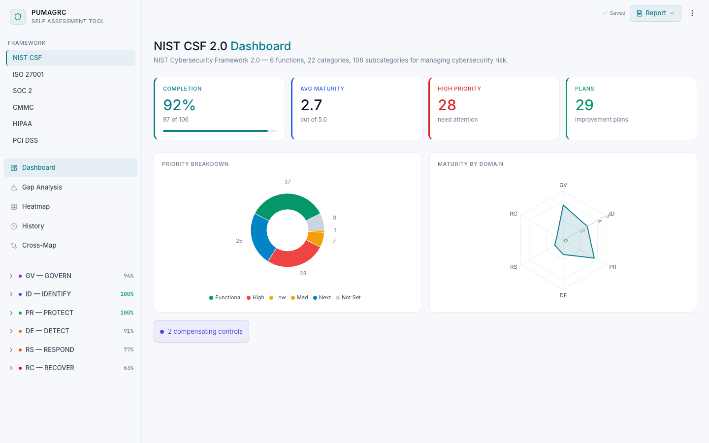
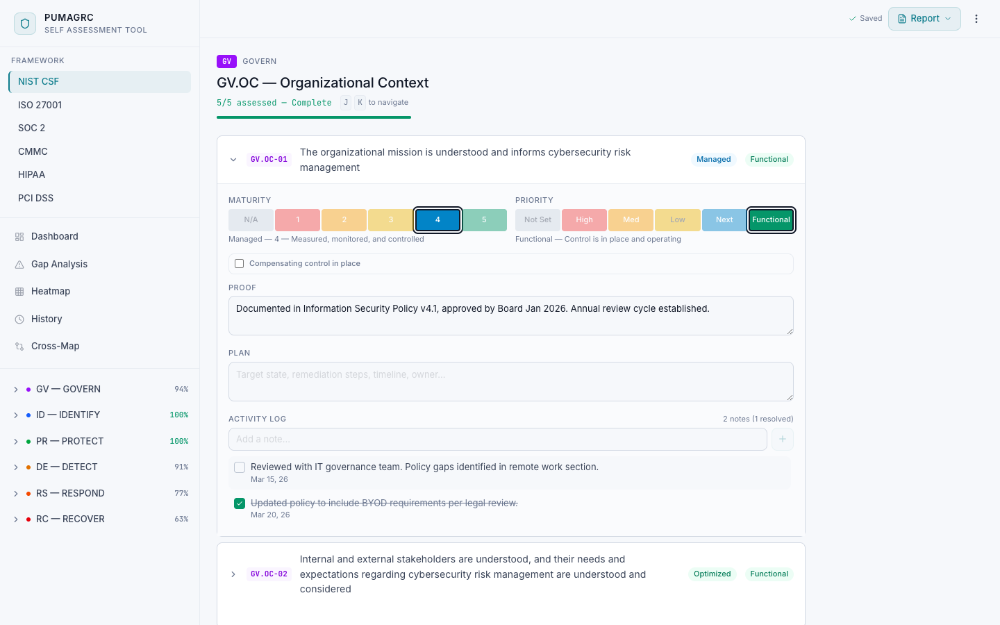
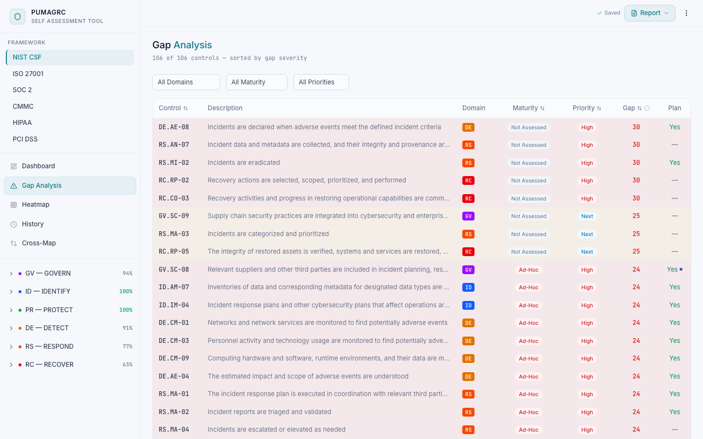
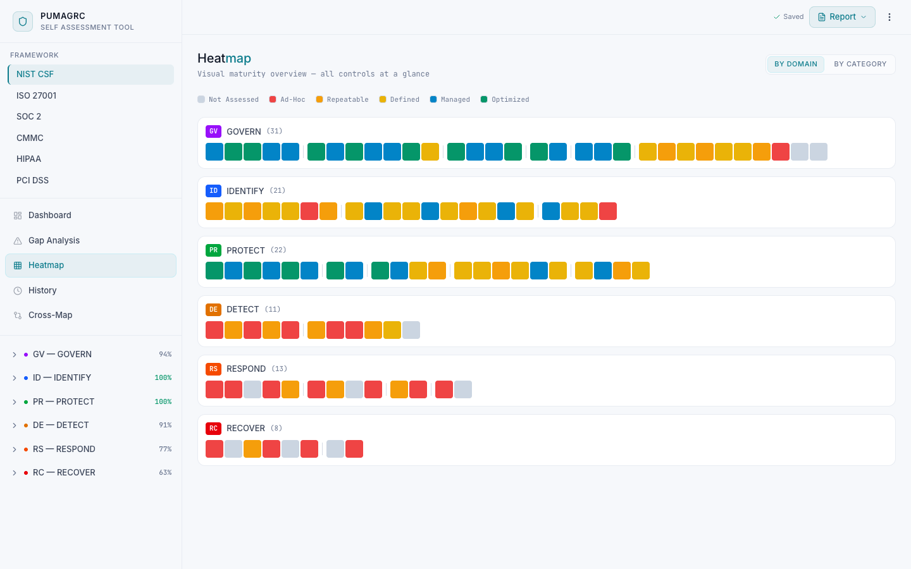
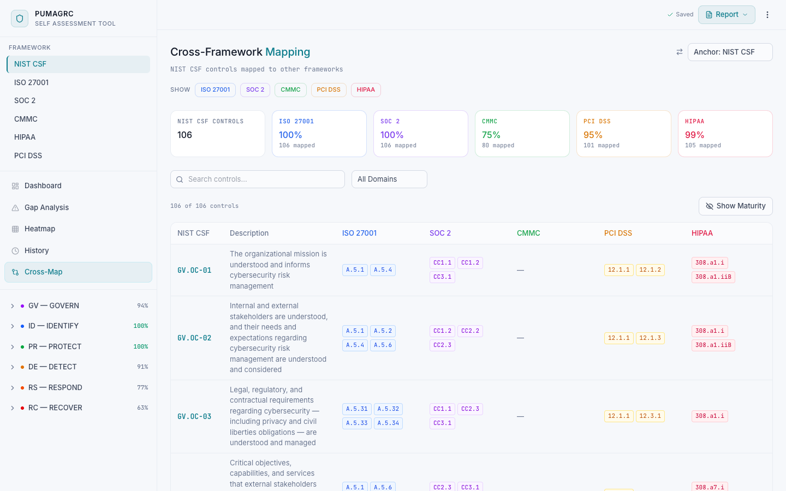
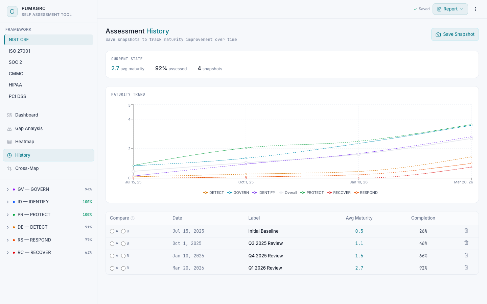

# PumaGRC

A multi-framework compliance self-assessment tool. Rate your organization's maturity across security frameworks, track progress, identify gaps, and generate reports.

Built by [Greykit.com](https://www.greykit.com)



## Supported Frameworks

- **NIST CSF 2.0** — Cybersecurity Framework
- **ISO 27001** — Information Security Management
- **SOC 2 (TSC)** — Trust Services Criteria
- **CMMC 2.0** — Cybersecurity Maturity Model Certification
- **HIPAA** — Health Insurance Portability and Accountability Act
- **PCI DSS** — Payment Card Industry Data Security Standard

## Features

### Dashboard
Overview of completion, average maturity, priority breakdown, and maturity-by-domain radar chart.


### Category Assessment
Expand controls inline to rate maturity (0–5), set priority, record evidence, and log activity notes.



### Gap Analysis
Sortable/filterable table highlighting controls that need attention, ranked by gap severity.



### Heatmap
Visual grid of all controls colored by maturity level. Click any cell to assess directly.



### Cross-Framework Mapping
Side-by-side view of controls across all enabled frameworks with mapping coverage stats.



### Assessment History
Save named snapshots and track maturity improvement over time with trend charts.



### Reports
Export to PDF or Word for stakeholder presentations.

## Tech Stack

- React 19 + TypeScript
- Vite
- Tailwind CSS v4
- Recharts
- jsPDF / docx for report generation
- localStorage for persistence

## Getting Started

```bash
npm install
npm run dev
```

Open [http://localhost:5173](http://localhost:5173).

### First Steps

1. Open the overflow menu (three dots) and select **Configure Frameworks** to enable the standards you need
2. Select a category from the sidebar to begin assessing controls
3. Use **Export JSON** from the overflow menu to back up your data

### Demo Data

Import `public/demo.json` via the overflow menu's **Import JSON** to load sample assessment data across multiple frameworks with snapshot history.

## Data Storage

All assessment data is stored in your browser's localStorage. **This is not a secure datastore.** Export your data regularly using the JSON export feature. Clearing browser data will erase your assessments.

## Scripts

| Command | Description |
|---------|-------------|
| `npm run dev` | Start dev server |
| `npm run build` | Type-check and build for production |
| `npm run preview` | Preview production build |
| `npm run lint` | Run ESLint |

## Disclaimer

This tool is provided as-is, with no warranties or guarantees of any kind. Use it at your own risk. See the full disclaimer in the app under Help & About.

## License

Private — not licensed for redistribution.
